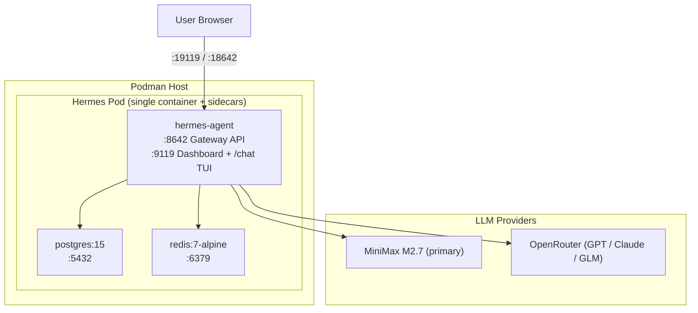

<div align="center">
  <h1>WoowTech Hermes Agent — Podman</h1>
  <p><strong>Enterprise AI Assistant · Podman Compose deployment</strong><br/>
     <sub>Single-container architecture (v0.17.0+) · 47 CLI tools · 93 skills · Dashboard TUI as the sole chat surface</sub></p>

  <p>
    
    
    
    
    
  </p>

  <p>
    <a href="README.md">English</a> ·
    <a href="README_zh-TW.md">繁體中文</a>
  </p>
</div>

> [!IMPORTANT]
> **This repository ships only the Podman Compose deployment.**
> The Kubernetes/K3s deployment lives in its sibling repo as a **Helm chart**:
> [**WOOWTECH/Woow_k3s_hermes**](https://github.com/WOOWTECH/Woow_k3s_hermes).
>
> This repository is one of the per-platform splits of the retired monorepo
> `Woow_hermes_agent_docker_compose_all`. Git history from the old `podman`
> branch is preserved here on `main`.

---

## Overview

**WoowTech Hermes Agent** is an enterprise-grade, self-hosted AI assistant platform built on
[Nous Research Hermes Agent](https://github.com/NousResearch/hermes-agent). It provides a
complete AI workspace with a single Dashboard TUI chat surface (xterm.js REPL of `hermes chat`
inside the agent container), 47 pre-installed CLI tools, 93 AI skills, and multi-LLM support —
deployable via Podman Compose on a single host.

### Podman-branch operational model

The stack is **100% containerized** — the Hermes Agent binary is the upstream image
`docker.io/nousresearch/hermes-agent`, not Woowtech-authored code, so **nothing runs on the host**.
Shell access is **host OpenSSH → `podman exec -it hermes-agent bash`**. Hermes's built-in
Dashboard TUI (`HERMES_DASHBOARD_TUI=1`) at `http://<host>:19119` is an **app-internal** admin
terminal, not a system shell. There is **no ttyd** in the Podman deployment (ttyd is a K3s-only
add-on and lives in the sibling k3s repo).

### v0.17.0 breaking change

The `hermes-webui` sidecar has been removed. Dashboard TUI (port `19119`) is now the only chat
surface. Migrating from v0.16.x or earlier? See [CHANGELOG.md](CHANGELOG.md) `[0.17.0]` for
BREAKING notes and rollback guidance.

---

## Quick Start

**Prerequisites**: Podman 4.x+, `podman-compose`, 8 GB+ RAM.

```bash
# 1. Clone this repo
git clone https://github.com/WOOWTECH/Woow_podman_hermes.git
cd Woow_podman_hermes

# 2. Copy and edit environment file
cd deploy/podman
cp .env.example .env
vim .env    # set API keys, dashboard password, DB password

# 3. Deploy
podman-compose up -d
```

Ports on the host after deploy:

| Service              | URL                     | Purpose                                                   |
|----------------------|-------------------------|-----------------------------------------------------------|
| Dashboard (+ chat)   | `http://<host>:19119`   | Admin + `/chat` xterm TUI (Basic auth)                    |
| Gateway API          | `http://<host>:18642`   | OpenAI-compatible REST API (`API_SERVER_KEY` bearer)      |

Front both with a reverse proxy or Cloudflare Tunnel for HTTPS.

---

## Repository Layout

```
.
├── deploy/podman/
│   ├── podman-compose.yml     # Pod definition: hermes-agent + postgres + redis
│   ├── .env.example           # All required environment variables
│   ├── deploy.sh              # 10-step automated deployment
│   ├── README.md              # Podman-specific deployment notes
│   └── SKILL.md               # Automation skill reference
├── docker/
│   ├── Dockerfile.hermes-agent  # 7-layer custom image (47 CLI tools + Playwright + CJK fonts)
│   └── build-image.sh
├── config/
│   ├── golden-config.yaml     # Central Hermes config (630+ lines)
│   ├── golden-settings.json   # Dashboard defaults
│   ├── apply-env-fingerprint-patch.py
│   └── fix-model-routes.py    # Adds @openai-api:* routes
├── docs/                      # API contract, user manual (zh-TW), screenshots
├── skills/                    # Skill definitions
├── .github/                   # CI, CODEOWNERS, pre-push hook
├── CONTRIBUTING.md            # Repo-isolation policy
├── CHANGELOG.md
└── README* (this file + zh-TW)
```

---

## Key Features

| Feature                    | Description                                                                                              |
|----------------------------|----------------------------------------------------------------------------------------------------------|
| **Dashboard TUI**          | Dashboard (:19119) — chat + 150+ config settings + MCP + Terminal, all in one surface                    |
| **47 CLI Tools**           | curl, git, jq, yq, rg, fd, gcloud, gh, pandoc, ffmpeg, yt-dlp, nmap, and more                            |
| **93 AI Skills**           | 19 categories: software-dev, creative, MLOps, Odoo ERP, research, media                                  |
| **Multi-LLM**              | MiniMax M2.7 (primary), GPT-5.x/4.x via OpenRouter, Claude, GLM                                          |
| **Playwright + Chromium**  | Built-in browser automation for screenshots, form filling, E2E testing                                   |
| **Persistent Memory**      | SOUL.md (identity), USER.md (preferences), MEMORY.md (learned context)                                   |
| **Kanban + Tasks**         | Project boards, todo lists, cron job scheduling                                                          |
| **Insights Analytics**     | Token usage, model distribution, cost tracking                                                           |
| **Gateway API**            | OpenAI-compatible REST API on port 18642                                                                 |

---

## Architecture



`podman-compose.yml` defines three services in a single pod: `hermes-agent`, `postgres`, `redis`
(all bind-mounted or on named volumes `hermes-data` / `postgres-data` / `redis-data`).

---

## Configuration

### Environment variables (`deploy/podman/.env`)

| Variable                       | Required | Description                                                     |
|--------------------------------|----------|-----------------------------------------------------------------|
| `MINIMAX_API_KEY`              | Yes      | MiniMax primary-model API key                                   |
| `OPENROUTER_API_KEY`           | Yes      | OpenRouter API key for GPT/Claude/GLM                           |
| `API_SERVER_KEY`               | Yes      | Gateway API bearer token                                        |
| `DASHBOARD_USERNAME`           | Yes      | Dashboard Basic-auth username (default `admin`)                 |
| `DASHBOARD_PASSWORD`           | Yes      | Dashboard Basic-auth password                                   |
| `POSTGRES_PASSWORD`            | Yes      | PostgreSQL password                                             |
| `HERMES_DASHBOARD_PUBLIC_URL`  | Optional | Public URL for MCP OAuth callbacks                              |
| `HERMES_BASE_URL`              | Optional | Base URL override (used by some skills)                         |

### Golden configuration

`config/golden-config.yaml` is the central Hermes config (630+ lines).

| Section                | Description                                          |
|------------------------|------------------------------------------------------|
| `platforms.api_server` | 28 model routes, CORS, API key                       |
| `llm`                  | Model, provider, temperature, max_tokens             |
| `mcp.servers`          | Playwright, filesystem, fetch                        |
| `agent`                | approval_mode, tools, skills                         |
| `dashboard`            | Auth, TUI, themes, plugins                           |

### Model routing

Run `config/fix-model-routes.py` after config changes to add `@openai-api:*` routes for
OpenAI-compatible clients.

---

## Custom Docker Image

`docker/Dockerfile.hermes-agent` extends the base image with 7 layers:

| Layer  | Packages                                                            | Size    |
|--------|---------------------------------------------------------------------|---------|
| Core   | jq, fd, rsync, mosh, git-lfs, imagemagick, nmap, dnsutils           | ~50 MB  |
| Binary | yq v4.44.6, cloudflared, gh CLI v2.73                               | ~80 MB  |
| Cloud  | Google Cloud SDK (gcloud, gsutil, bq)                               | ~200 MB |
| Content| pandoc, texlive-xetex, CJK + emoji fonts                            | ~300 MB |
| Web    | Playwright + Chromium 148, httpie, yt-dlp                           | ~400 MB |
| Fix    | Dashboard TUI ownership fix                                         | ~0 MB   |
| Ident  | Git config for Hermes Bot identity                                  | ~0 MB   |

Build & push:

```bash
cd docker
docker build -t hermes-agent-custom:latest -f Dockerfile.hermes-agent .
docker tag hermes-agent-custom:latest <registry>/hermes-agent-custom:latest
docker push <registry>/hermes-agent-custom:latest
```

---

## MCP Integration

Hermes supports remote [MCP](https://modelcontextprotocol.io/) servers.

| Server         | Auth              | Notes                          |
|----------------|-------------------|--------------------------------|
| Higgsfield     | OAuth 2.1 + PKCE  | Authenticate via Dashboard     |
| Browserless    | Bearer Token      | API key in headers             |
| Cloudflare     | OAuth 2.1 + PKCE  | Authenticate via Dashboard     |
| WoowTech Odoo  | URL Token         | Auto-connects                  |

For OAuth flows the callback path `/api/mcp/oauth/callback/*` must be publicly reachable and
`HERMES_DASHBOARD_PUBLIC_URL` must be set.

---

## Screenshots

See [`docs/screenshots/`](docs/screenshots/) for login, chat, model picker, skills catalog,
memory page, Kanban, dashboard config, and mobile views.

---

## API Reference

Full API documentation: [docs/api-contract.md](docs/api-contract.md).
The Dashboard exposes 28 REST endpoints on port 9119 (config, sessions, skills, memory,
analytics, logs, model info).

---

## Troubleshooting

| Issue                                | Cause                        | Solution                                                    |
|--------------------------------------|------------------------------|-------------------------------------------------------------|
| Dashboard TUI blank                  | Permission mismatch          | Dockerfile Layer 7 fixes this; rebuild custom image         |
| Dashboard login rejects credentials  | Missing/wrong Basic-auth env | Verify `DASHBOARD_USERNAME` / `DASHBOARD_PASSWORD`; restart |
| Model returns wrong provider         | Missing `@openai-api:` route | Run `config/fix-model-routes.py`                            |
| Volume full                          | Old conversations accumulate | Archive/delete old sessions via Dashboard Settings          |
| Playwright fails                     | Chromium not installed       | Ensure the custom image is used (not the base image)        |
| `.env` not syncing after update      | Fingerprint mismatch         | Run `config/apply-env-fingerprint-patch.py`                 |

---

## Related Repositories

| Platform                 | Repository                                                                                    |
|--------------------------|-----------------------------------------------------------------------------------------------|
| Podman Compose (this)    | [WOOWTECH/Woow_podman_hermes](https://github.com/WOOWTECH/Woow_podman_hermes)                 |
| K3s / Kubernetes (Helm)  | [WOOWTECH/Woow_k3s_hermes](https://github.com/WOOWTECH/Woow_k3s_hermes)                       |

The old monorepo `Woow_hermes_agent_docker_compose_all` is archived; branch-per-platform is
retired. Full git history from the `podman` branch is preserved on this repo's `main`.

---

## Changelog

See [CHANGELOG.md](CHANGELOG.md). Recent highlights:

- **v0.17.0** (BREAKING) — removed `hermes-webui`; Dashboard TUI is the only chat surface; ports simplified to `19119` + `18642`.
- **v0.15** — `@openai-api:*` routes, model list sync, `.env` fingerprint sync patch, Playwright E2E.
- **v0.13** — custom Docker image (47 CLI tools + Playwright), 7-round enterprise test suite, Podman Compose deployment.

---

## Support & License

Maintained by **WOOW Tech (沃科技)**. Upstream: [Nous Research Hermes Agent](https://github.com/NousResearch/hermes-agent).

**License**: Proprietary — WOOW Tech deployment and customization layer. Upstream components retain their respective licenses.
