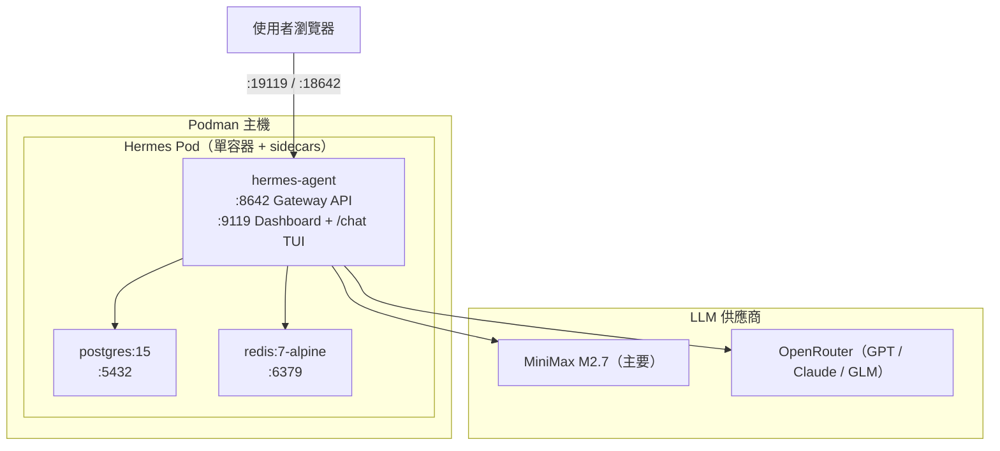

<div align="center">
  <h1>WoowTech Hermes Agent — Podman</h1>
  <p><strong>企業級 AI 智慧助手 · Podman Compose 部署</strong><br/>
     <sub>單容器架構（v0.17.0 起）· 47 個 CLI 工具 · 93 個技能 · Dashboard TUI 為唯一 chat 介面</sub></p>

  <p>
    
    
    
    
    
  </p>

  <p>
    <a href="README.md">English</a> ·
    <a href="README_zh-TW.md">繁體中文</a>
  </p>
</div>

> [!IMPORTANT]
> **本倉庫僅提供 Podman Compose 部署方案。**
> Kubernetes/K3s 部署已改為 **Helm chart**，位於姊妹倉庫：
> [**WOOWTECH/Woow_k3s_hermes**](https://github.com/WOOWTECH/Woow_k3s_hermes)。
>
> 本倉庫是舊 monorepo `Woow_hermes_agent_docker_compose_all` 按部署平台拆分後的其中一個；
> 舊 `podman` 分支的完整 git 歷史已保留於本倉庫的 `main`。

---

## 總覽

**WoowTech Hermes Agent** 是基於 [Nous Research Hermes Agent](https://github.com/NousResearch/hermes-agent) 打造的
企業級自建 AI 助手平台。提供完整的 AI 工作空間：單一 Dashboard TUI chat 介面
（agent 容器內以 xterm.js 執行 `hermes chat` REPL）、47 個預裝 CLI 工具、93 個 AI 技能、
多 LLM 支援，可透過 Podman Compose 部署於單一主機。

### Podman 分支運維模型

整個 stack **100% 容器化** — Hermes Agent 二進位是上游 image
`docker.io/nousresearch/hermes-agent`，不是 Woowtech 自產程式碼，因此**主機上沒有任何要跑的東西**。
Shell 入口是**主機 OpenSSH → `podman exec -it hermes-agent bash`**。
Hermes 內建 Dashboard TUI（`HERMES_DASHBOARD_TUI=1`）在 `http://<host>:19119` 是
**應用內建**的管理員終端，不是系統 shell。**本部署不含 ttyd**（ttyd 是 K3s 專用的附加元件，
位於姊妹 k3s 倉庫）。

### v0.17.0 破壞性變更

`hermes-webui` sidecar 已移除，Dashboard TUI（port `19119`）已成為唯一 chat 介面。
從 v0.16.x 或更早版本升級請參閱 [CHANGELOG.md](CHANGELOG.md) `[0.17.0]` 的 BREAKING 說明與回滾指引。

---

## 快速開始

**前置需求**：Podman 4.x+、`podman-compose`、8 GB+ RAM。

```bash
# 1. Clone 本倉庫
git clone https://github.com/WOOWTECH/Woow_podman_hermes.git
cd Woow_podman_hermes

# 2. 複製並編輯環境變數檔
cd deploy/podman
cp .env.example .env
vim .env    # 填入 API 金鑰、Dashboard 密碼、DB 密碼

# 3. 部署
podman-compose up -d
```

部署後主機上的埠：

| 服務                  | URL                     | 用途                                                        |
|-----------------------|-------------------------|-------------------------------------------------------------|
| Dashboard（含 chat）  | `http://<host>:19119`   | 管理面板 + `/chat` xterm TUI（Basic auth）                  |
| Gateway API           | `http://<host>:18642`   | OpenAI 相容 REST API（`API_SERVER_KEY` bearer）             |

兩者建議前面掛反向代理或 Cloudflare Tunnel 提供 HTTPS。

---

## 倉庫結構

```
.
├── deploy/podman/
│   ├── podman-compose.yml     # Pod 定義：hermes-agent + postgres + redis
│   ├── .env.example           # 所有必要環境變數
│   ├── deploy.sh              # 10 步驟自動化部署
│   ├── README.md              # Podman 部署細節
│   └── SKILL.md               # 自動化 skill 參考
├── docker/
│   ├── Dockerfile.hermes-agent  # 7 層自訂 image（47 CLI + Playwright + 中文字型）
│   └── build-image.sh
├── config/
│   ├── golden-config.yaml     # Hermes 中央配置（630+ 行）
│   ├── golden-settings.json   # Dashboard 預設值
│   ├── apply-env-fingerprint-patch.py
│   └── fix-model-routes.py    # 補齊 @openai-api:* 路由
├── docs/                      # API 合約、繁中使用手冊、截圖
├── skills/                    # 技能定義
├── .github/                   # CI、CODEOWNERS、pre-push hook
├── CONTRIBUTING.md            # 倉庫隔離政策
├── CHANGELOG.md
└── README* (本檔 + zh-TW)
```

---

## 核心功能

| 功能                        | 說明                                                                                          |
|-----------------------------|-----------------------------------------------------------------------------------------------|
| **Dashboard TUI**           | Dashboard（:19119）— chat + 150+ 配置項 + MCP + Terminal，一站式介面                          |
| **47 個 CLI 工具**          | curl、git、jq、yq、rg、fd、gcloud、gh、pandoc、ffmpeg、yt-dlp、nmap 等                        |
| **93 個 AI 技能**           | 19 個類別：軟體開發、創意、MLOps、Odoo ERP、研究、媒體                                        |
| **多 LLM 支援**             | MiniMax M2.7（主要）、GPT-5.x/4.x via OpenRouter、Claude、GLM                                 |
| **Playwright + Chromium**   | 內建瀏覽器自動化，可截圖、填表、E2E 測試                                                      |
| **持久化記憶**              | SOUL.md（身分）、USER.md（偏好）、MEMORY.md（學習到的上下文）                                 |
| **Kanban + Tasks**          | 專案看板、待辦清單、cron 排程                                                                 |
| **Insights 分析**           | Token 用量、模型分佈、成本追蹤                                                                |
| **Gateway API**             | Port 18642，OpenAI 相容 REST API                                                              |

---

## 系統架構



`podman-compose.yml` 於單一 pod 內定義三個服務：`hermes-agent`、`postgres`、`redis`
（全部以 bind mount 或 named volume `hermes-data` / `postgres-data` / `redis-data` 保存資料）。

---

## 配置

### 環境變數（`deploy/podman/.env`）

| 變數                            | 必填 | 說明                                                     |
|---------------------------------|------|----------------------------------------------------------|
| `MINIMAX_API_KEY`               | 是   | MiniMax 主模型 API 金鑰                                  |
| `OPENROUTER_API_KEY`            | 是   | OpenRouter API 金鑰（GPT/Claude/GLM）                    |
| `API_SERVER_KEY`                | 是   | Gateway API bearer token                                 |
| `DASHBOARD_USERNAME`            | 是   | Dashboard Basic-auth 帳號（預設 `admin`）                |
| `DASHBOARD_PASSWORD`            | 是   | Dashboard Basic-auth 密碼                                |
| `POSTGRES_PASSWORD`             | 是   | PostgreSQL 密碼                                          |
| `HERMES_DASHBOARD_PUBLIC_URL`   | 選填 | MCP OAuth 回呼所需的對外 URL                             |
| `HERMES_BASE_URL`               | 選填 | Base URL 覆蓋（某些技能會用）                            |

### Golden 配置

`config/golden-config.yaml` 是 Hermes 中央配置檔（630+ 行）。

| 區塊                   | 說明                                                    |
|------------------------|---------------------------------------------------------|
| `platforms.api_server` | 28 條模型路由、CORS、API 金鑰                           |
| `llm`                  | 模型、供應商、temperature、max_tokens                   |
| `mcp.servers`          | Playwright、filesystem、fetch                           |
| `agent`                | approval_mode、tools、skills                            |
| `dashboard`            | Auth、TUI、themes、plugins                              |

### 模型路由

修改配置後執行 `config/fix-model-routes.py` 為 OpenAI 相容客戶端補上 `@openai-api:*` 路由。

---

## 自訂 Docker 映像

`docker/Dockerfile.hermes-agent` 在基底映像上疊加 7 層：

| 層次    | 套件                                                             | 大小     |
|---------|------------------------------------------------------------------|----------|
| Core    | jq、fd、rsync、mosh、git-lfs、imagemagick、nmap、dnsutils        | ~50 MB   |
| Binary  | yq v4.44.6、cloudflared、gh CLI v2.73                            | ~80 MB   |
| Cloud   | Google Cloud SDK（gcloud、gsutil、bq）                           | ~200 MB  |
| Content | pandoc、texlive-xetex、中文與 emoji 字型                         | ~300 MB  |
| Web     | Playwright + Chromium 148、httpie、yt-dlp                        | ~400 MB  |
| Fix     | Dashboard TUI 權限修正                                           | ~0 MB    |
| Ident   | Hermes Bot 的 Git 身分設定                                       | ~0 MB    |

建置與推送：

```bash
cd docker
docker build -t hermes-agent-custom:latest -f Dockerfile.hermes-agent .
docker tag hermes-agent-custom:latest <registry>/hermes-agent-custom:latest
docker push <registry>/hermes-agent-custom:latest
```

---

## MCP 整合

Hermes 支援連接遠端 [MCP](https://modelcontextprotocol.io/) 伺服器。

| 伺服器          | Auth              | 備註                       |
|-----------------|-------------------|----------------------------|
| Higgsfield      | OAuth 2.1 + PKCE  | 從 Dashboard 完成授權      |
| Browserless     | Bearer Token      | API key 放在 header        |
| Cloudflare      | OAuth 2.1 + PKCE  | 從 Dashboard 完成授權      |
| WoowTech Odoo   | URL Token         | 自動連線                   |

OAuth 流程需要 callback path `/api/mcp/oauth/callback/*` 對外可達，並設定
`HERMES_DASHBOARD_PUBLIC_URL`。

---

## 截圖

參閱 [`docs/screenshots/`](docs/screenshots/)：登入、聊天、模型選擇器、技能目錄、
記憶頁、Kanban、Dashboard 配置、行動裝置樣式。

---

## API 參考

完整 API 文件：[docs/api-contract.md](docs/api-contract.md)。
Dashboard（port 9119）共 28 個 REST 端點（config、sessions、skills、memory、
analytics、logs、model info）。

---

## 疑難排解

| 問題                                | 原因                             | 解法                                                        |
|-------------------------------------|----------------------------------|-------------------------------------------------------------|
| Dashboard TUI 空白                  | 權限錯誤                         | Dockerfile Layer 7 已修，需重建自訂 image                    |
| Dashboard 登入被拒                  | Basic-auth env 未設或錯誤        | 確認 `DASHBOARD_USERNAME` / `DASHBOARD_PASSWORD` 後重啟      |
| 模型走錯供應商                      | 缺 `@openai-api:` 路由           | 執行 `config/fix-model-routes.py`                            |
| Volume 塞滿                         | 舊對話累積                       | 從 Dashboard 設定頁封存/刪除舊 session                       |
| Playwright 失敗                     | Chromium 未安裝                  | 確認使用自訂 image（非基底 image）                           |
| `.env` 更新後未同步                 | Fingerprint 不一致               | 執行 `config/apply-env-fingerprint-patch.py`                 |

---

## 相關倉庫

| 部署平台                    | 倉庫                                                                                            |
|-----------------------------|-------------------------------------------------------------------------------------------------|
| Podman Compose（本倉庫）    | [WOOWTECH/Woow_podman_hermes](https://github.com/WOOWTECH/Woow_podman_hermes)                   |
| K3s / Kubernetes（Helm）    | [WOOWTECH/Woow_k3s_hermes](https://github.com/WOOWTECH/Woow_k3s_hermes)                         |

舊 monorepo `Woow_hermes_agent_docker_compose_all` 已封存；branch-per-platform 已淘汰。
舊 `podman` 分支的完整 git 歷史已保留於本倉庫 `main`。

---

## 更新日誌

見 [CHANGELOG.md](CHANGELOG.md)。近期重點：

- **v0.17.0**（BREAKING）— 移除 `hermes-webui`；Dashboard TUI 成為唯一 chat 介面；埠簡化為 `19119` + `18642`。
- **v0.15** — 補上 `@openai-api:*` 路由、同步模型清單、`.env` fingerprint sync patch、Playwright E2E。
- **v0.13** — 自訂 Docker image（47 CLI + Playwright）、7 輪企業級測試套件、Podman Compose 部署。

---

## 支援與授權

由 **WOOW Tech（沃科技）** 維護。上游：[Nous Research Hermes Agent](https://github.com/NousResearch/hermes-agent)。

**授權**：Proprietary — WOOW Tech 部署與客製化層。上游元件保留各自的授權條款。
