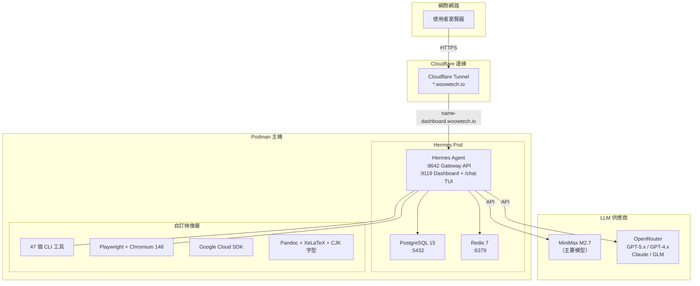
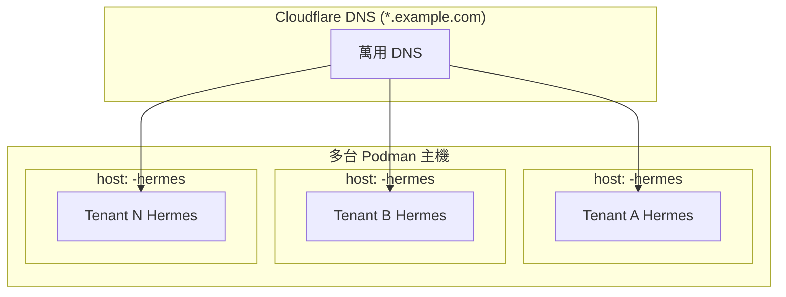
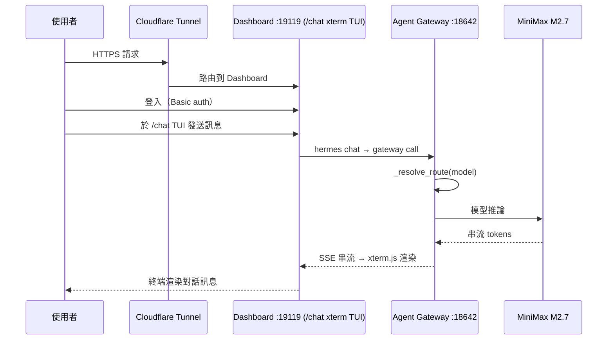
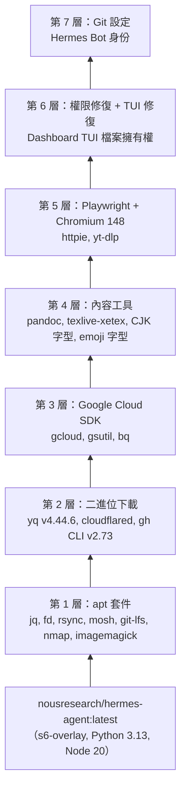
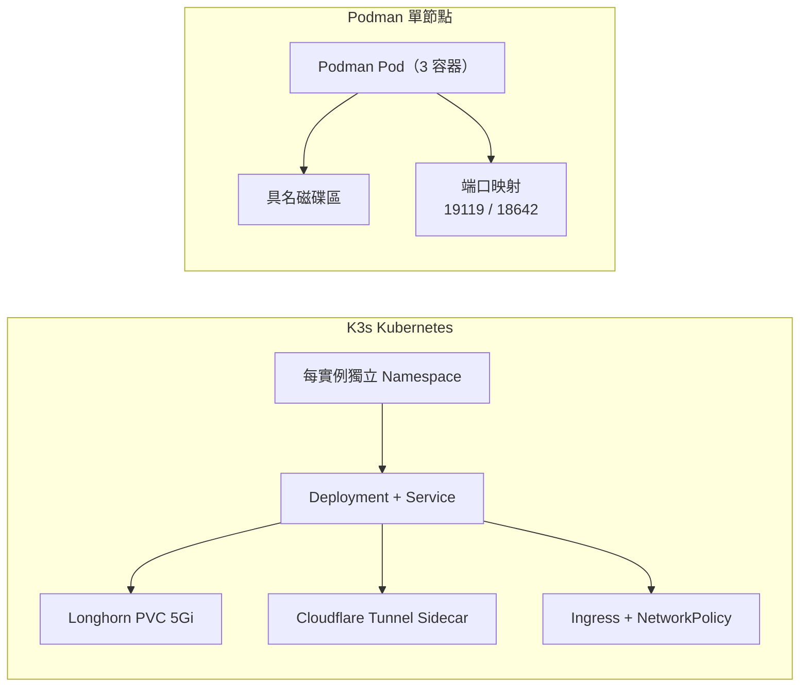

<div align="center">
  

  <h1>WoowTech Hermes Agent</h1>
  <p><strong>企業級 AI 智慧助手 — Podman 部署</strong><br/><sub>單容器架構（v0.17.0 起）；47 個 CLI 工具、93 個技能、Dashboard TUI 唯一 chat 介面</sub></p>

  <p>
    
    
    
    
    
    
    
  </p>

  <p>
    <a href="README.md">English</a> |
    <a href="README_zh-TW.md">繁體中文</a>
  </p>

  <p>
    <code>main</code> · <a href="../../tree/k3s"><code>k3s</code></a> · <strong><code>podman</code></strong>
  </p>
</div>

> **這是 `podman` 分支** — 包含 Podman Compose 單節點部署方案。<br/>
> 需要 Kubernetes？切換到 [`k3s` 分支](../../tree/k3s)。<br/>
> 需要概覽？請見 [`main` 分支](../../tree/main)。
>
> **⚠️ Podman 分支的運維模型（與 K3s 不同）:**
> 整個 stack 100% 容器化 — Hermes Agent 二進位是上游 image
> `docker.io/nousresearch/hermes-agent`,不是 Woowtech 自產程式碼,因此**主機上沒有任何要跑的東西**。
> 下方「瀏覽器終端(ttyd)」章節描述的是 K3s 部署(`11-terminal.yaml`);
> **本分支不部署 ttyd**。Shell 入口是**主機 OpenSSH → `podman exec -it hermes-agent bash`**。
> Hermes 內建 Dashboard TUI(`HERMES_DASHBOARD_TUI=1`)在 `http://<host>:19119`
> 是**應用內建**的管理員終端,不是系統 shell。

> **遷移說明（v0.17.0）：** `hermes-webui` sidecar 已移除，Dashboard TUI 已成為唯一 chat 介面。
> 從 v0.16.x 或更早版本升級請參閱 [CHANGELOG](CHANGELOG.md) 的 BREAKING 說明與回滾指引。

---

## 目錄

- [總覽](#總覽)
- [核心功能](#核心功能)
- [系統架構](#系統架構)
- [系統元件](#系統元件)
- [截圖展示](#截圖展示)
- [部署方式](#部署方式)
- [快速開始](#快速開始)
- [配置說明](#配置說明)
- [自訂 Docker 映像](#自訂-docker-映像)
- [多實例部署](#多實例部署)
- [CLI 工具參考](#cli-工具參考)
- [技能目錄](#技能目錄)
- [API 參考](#api-參考)
- [測試](#測試)
- [安全性](#安全性)
- [疑難排解](#疑難排解)
- [更新日誌](#更新日誌)
- [支援與授權](#支援與授權)

---

## 總覽

**WoowTech Hermes Agent** 是基於 [Nous Research Hermes Agent](https://github.com/NousResearch/hermes-agent) 打造的企業級自建 AI 助手平台。提供完整的 AI 工作空間：單一 Dashboard TUI chat 介面（agent 容器內以 xterm.js 執行 `hermes chat` REPL）、47 個預裝 CLI 工具、93 個 AI 技能、多 LLM 支援，可透過 Podman Compose 部署於單一主機。

### 為什麼選擇 WoowTech Hermes？

| 挑戰 | WoowTech 方案 |
|------|--------------|
| SaaS AI 工具存在資料外洩風險 | **自建部署**，資料留在自己的基礎設施 |
| 通用 AI 助手缺乏領域知識 | **93 個領域技能**，包含 Odoo 18 ERP、ESG/WELL/LEED、金融 |
| 單一模型綁定 | **多 LLM 支援**：MiniMax M2.7 主要模型 + OpenAI/Claude/GLM via OpenRouter |
| 無瀏覽器自動化能力 | **Playwright + Chromium 148** 內建於 Agent 容器 |
| Kubernetes 部署複雜 | **一鍵部署** `deploy.sh` + 黃金配置 |
| 僅支援單租戶 | **多實例隔離**，命名空間隔離 + 每租戶獨立品牌 |

---

## 核心功能

| 功能 | 說明 |
|------|------|
| **Dashboard TUI** | Dashboard (:19119) — chat（xterm.js REPL 執行 `hermes chat`）+ 150+ 設定 + MCP + Terminal，皆在 agent 容器內運行 |
| **47 個 CLI 工具** | curl, git, jq, yq, rg, fd, gcloud, gh, pandoc, ffmpeg, yt-dlp, nmap 等 |
| **93 個 AI 技能** | 19 類別：軟體開發、創意設計、MLOps、Odoo ERP、學術研究、媒體 |
| **多 LLM 支援** | MiniMax M2.7（主要）, GPT-5.x/4.x via OpenRouter, Claude, GLM |
| **模型路由** | Gateway `model_routes` 支援 `@openai:` 和 `@openai-api:` 前綴 |
| **Playwright + Chromium** | 內建瀏覽器自動化，支援截圖、表單填寫、E2E 測試 |
| **持久化記憶** | SOUL.md（身份）、USER.md（偏好）、MEMORY.md（學習上下文） |
| **看板 + 任務** | 專案看板、待辦清單、排程任務管理 |
| **數據分析** | Token 用量、模型分布、費用追蹤 |
| **Gateway API** | OpenAI 相容 REST API，端口 18642 |
| **Cloudflare Tunnel** | 自動 HTTPS，無需端口轉發或憑證 |

---

## 系統架構

### 系統架構圖



### 多實例架構



### 請求流程



### Docker 映像層結構



### 部署方式比較



---

## 系統元件

| 元件 | 映像 | 端口 | 用途 | K8s Manifest |
|------|------|------|------|-------------|
| **Hermes Agent** | `nousresearch/hermes-agent:latest` | 8642（Gateway）、9119（Dashboard + /chat TUI） | AI 引擎、工具執行、Gateway API、Dashboard 及 xterm.js chat TUI | `06-hermes.yaml` |
| **瀏覽器終端** | `ubuntu:24.04` + ttyd 1.7.7 | 7681 | 瀏覽器 TUI — kubectl exec 進入 hermes-agent shell（僅 K3s） | `11-terminal.yaml` |
| **PostgreSQL** | `postgres:15` | 5432 | 資料持久化（對話、記憶、設定） | `04-postgresql.yaml` |
| **Redis** | `redis:7-alpine` | 6379 | 快取、Session 狀態 | `05-redis.yaml` |
| **Cloudflared** | `cloudflare/cloudflared:latest` | — | Cloudflare Tunnel，提供 HTTPS 存取 | `08-cloudflared.yaml` |

---

## 服務 URL

Podman 部署對外暴露兩個服務（可搭配 Cloudflare Tunnel 提供 HTTPS）：

| 服務 | URL | 端口 | 用途 |
|------|-----|------|------|
| **Dashboard**（管理 + Chat TUI） | `http://<host>:19119` | 19119 → 9119 | Agent 管理（設定、MCP、模型、日誌、系統）+ `/chat` 內建 xterm.js `hermes chat` REPL |
| **Gateway API** | `http://<host>:18642` | 18642 → 8642 | OpenAI 相容 REST API |

服務認證：
- Dashboard：帳號 / 密碼（Basic auth，`DASHBOARD_USERNAME` / `DASHBOARD_PASSWORD`）
- Gateway：`API_SERVER_KEY` bearer token

---

## MCP 整合

Hermes 支援連接遠端 [Model Context Protocol (MCP)](https://modelcontextprotocol.io/) 伺服器，擴展工具能力。

### 已設定的 MCP Server

| Server | URL | 認證方式 | 狀態 |
|--------|-----|---------|------|
| Higgsfield | `https://mcp.higgsfield.ai/mcp` | OAuth 2.1 + PKCE | Dashboard 授權 |
| Browserless | `https://mcp.browserless.io/mcp` | Bearer Token | API key |
| Cloudflare | `https://mcp.cloudflare.com/mcp` | OAuth 2.1 + PKCE | Dashboard 授權 |
| WoowTech Odoo | `https://woowtech-mcp-odoo.woowtech.io/...` | URL Token | 自動連接 |

### Dashboard MCP OAuth 認證

需要 OAuth 的 MCP Server 可直接從 Dashboard 完成認證：

1. 前往 **Dashboard → MCP** 頁面
2. 點擊 **🔑 Authenticate**
3. 在彈出視窗完成 OAuth 登入
4. Token 自動儲存並定期刷新

**必要設定：**
- `HERMES_DASHBOARD_PUBLIC_URL` 需指向 Dashboard 的公開 URL

---

## 瀏覽器終端（ttyd）

提供瀏覽器直接存取 hermes-agent 容器的 bash shell，與 Agent 在相同的環境中操作。

### 架構

```
瀏覽器 → Cloudflare Tunnel → ttyd Pod (:7681) → connect.sh → kubectl exec → hermes-agent bash
```

### 存取方式

```
URL:  https://<PREFIX>-hermes-terminal.woowtech.io
認證: HTTP Basic Auth（admin / 設定的密碼）
```

### 終端中可用的工具

- `hermes` CLI（version、config、mcp list/login 等）
- 全部 47 個預裝 CLI 工具
- Python 3.13 + pip
- 直接存取 `/opt/data/config.yaml` 和 `.hermes/` 狀態目錄

---

## 截圖展示

### 登入頁面


> 純密碼登入 — 無需帳號，適合團隊快速共享存取。

### 對話介面


> 完整功能的對話介面，支援 Markdown 渲染、程式碼高亮、串流回應。

### AI 回應


> AI 回應支援程式碼區塊、表格、Markdown 格式化、工具呼叫結果。

### 模型選擇器


> 即時切換 MiniMax M2.7、GPT-5.x、GPT-4.x 等多種模型。

### 技能目錄


> 93 個預載 AI 技能，涵蓋軟體開發、Odoo ERP 等 19 個類別。

### 記憶管理


> 持久化記憶系統：SOUL.md（身份）、USER.md（偏好）、MEMORY.md（學習上下文）。

### 數據分析


> 追蹤 Token 用量、模型分布、對話指標、費用分析。

### 看板


> 內建看板，用於專案管理與任務追蹤。

### 任務與排程


> 使用 Cron 表達式排程定期任務，監控執行歷史。

### Dashboard（150+ 設定）


> 完整控制 Agent 行為、LLM 設定、MCP 伺服器、工具集等。

### 行動裝置響應式


> 完全響應式設計，手機和平板皆可使用。

---

## 部署方式

### 比較

| 功能 | K3s Kubernetes | Podman 單節點 |
|------|---------------|--------------|
| **適用場景** | 多實例正式環境 | 單實例 / 開發測試 |
| **擴展性** | 水平擴展（多命名空間） | 單一 Pod |
| **儲存** | Longhorn PVC（5Gi） | 具名磁碟區 |
| **網路** | Ingress + NetworkPolicy | 端口映射 |
| **HTTPS** | Cloudflare Tunnel（Sidecar） | 手動 / 反向代理 |
| **資源需求** | 共享叢集節點 | 獨立主機（8GB+ RAM） |

### Podman 部署

**前置條件**：Podman 4.x+、`podman-compose`、8GB+ RAM。

```bash
# 1. 複製本倉庫
git clone https://github.com/WOOWTECH/Woow_hermes_agent_docker_compose_all.git
cd Woow_hermes_agent_docker_compose_all

# 2. 複製並編輯環境變數
cd deploy/podman
cp .env.example .env
vim .env  # 設定 API keys

# 3. 部署
podman-compose up -d
```

端口：Dashboard `19119`、Gateway `18642`。

---

## 快速開始

```bash
# K3s（正式環境）
git clone https://github.com/WOOWTECH/Woow_hermes_agent_docker_compose_all.git
cd Woow_hermes_agent_docker_compose_all/deploy/k3s
cp ../../.env.example .env && vim .env
bash deploy.sh woowtech

# Podman（單節點）
cd deploy/podman
cp .env.example .env && vim .env
podman-compose up -d
```

---

## 配置說明

### 黃金配置（`config/golden-config.yaml`）

黃金配置是 Hermes Agent 的核心配置檔（630+ 行），主要區段：

| 區段 | 設定項 | 說明 |
|------|--------|------|
| `platforms.api_server` | 28 條模型路由、CORS、API 金鑰 | Gateway API 配置 |
| `llm` | model, provider, temperature, max_tokens | LLM 推論設定 |
| `mcp.servers` | Playwright, filesystem, fetch | MCP 伺服器配置 |
| `agent` | approval_mode, tools, skills | Agent 行為設定 |
| `dashboard` | auth, TUI, themes, plugins | Dashboard 配置 |

### 模型路由

Gateway 透過 `model_routes` 將模型別名路由到 LLM 供應商：

```yaml
model_routes:
  "@openai:gpt-5.4-mini":
    model: openai/gpt-5.4-mini
    base_url: https://openrouter.ai/api/v1
    api_key: __OPENROUTER_API_KEY__
  "@openai-api:gpt-5.4-mini":   # OpenAI 相容用戶端格式
    model: openai/gpt-5.4-mini
    base_url: https://openrouter.ai/api/v1
    api_key: __OPENROUTER_API_KEY__
```

**支援模型**（11 個模型 x 2 前綴 = 22 條路由）：
gpt-5.5, gpt-5.5-pro, gpt-5.4, gpt-5.4-mini, gpt-5.4-nano, gpt-5-mini, gpt-5.3-codex, gpt-5.2-codex, gpt-4.1, gpt-4o, gpt-4o-mini

### 環境變數

| 變數 | 必填 | 說明 |
|------|------|------|
| `MINIMAX_API_KEY` | 是 | MiniMax M2.7 API 金鑰 |
| `OPENROUTER_API_KEY` | 是 | OpenRouter API 金鑰（用於 GPT/Claude） |
| `API_SERVER_KEY` | 是 | Gateway API 認證金鑰 |
| `DASHBOARD_USERNAME` | 是 | Dashboard Basic-auth 帳號（預設 `admin`） |
| `DASHBOARD_PASSWORD` | 是 | Dashboard Basic-auth 密碼 |
| `TTYD_PASSWORD` | 選填 | ttyd 瀏覽器終端密碼（K3s `11-terminal.yaml`，本 podman 分支不部署） |
| `CLOUDFLARE_TUNNEL_TOKEN` | K3s 專用 | Cloudflare Tunnel Token |
| `POSTGRES_PASSWORD` | 是 | PostgreSQL 密碼 |

---

## 自訂 Docker 映像

自訂 Dockerfile（`docker/Dockerfile.hermes-agent`）在基礎映像上增加 7 層：

```bash
# 建置自訂映像
cd docker
docker build -t hermes-agent-custom:latest -f Dockerfile.hermes-agent .

# 推送到 Registry
docker tag hermes-agent-custom:latest <registry>/hermes-agent-custom:latest
docker push <registry>/hermes-agent-custom:latest
```

### 相較基礎映像新增的內容

| 層 | 套件 | 大小影響 |
|-----|------|---------|
| 核心 apt | jq, fd, rsync, mosh, git-lfs, imagemagick, nmap, dnsutils | ~50MB |
| 二進位 | yq v4.44.6, cloudflared, gh CLI v2.73 | ~80MB |
| Google Cloud | gcloud, gsutil, bq | ~200MB |
| 內容工具 | pandoc, texlive-xetex, CJK 字型, emoji 字型 | ~300MB |
| Playwright | Chromium 148, httpie, yt-dlp | ~400MB |
| 清理 | 權限修復、TUI 擁有權 | ~0MB |
| Git 設定 | Hermes Bot 身份 | ~0MB |

---

## 多實例部署

每個租戶實例運行在獨立的 Podman 主機上，擁有：
- 具名磁碟區作為 agent 資料（`hermes-data`）
- 同 pod 內共置的 PostgreSQL + Redis
- Cloudflare Tunnel 路由指向 Dashboard（`:19119`）

### 部署新實例

```bash
cd deploy/podman
cp .env.example .env
vim .env
podman-compose up -d
```

每台主機是自包含堆疊，本分支未提供跨主機的實例登記表。

---

## CLI 工具參考

自訂 Docker 映像包含 **47 個 CLI 工具**，涵蓋 6 大類別：

| 類別 | 數量 | 工具列表 |
|------|------|---------|
| **網路與連線** | 15 | curl, http, lynx, ssh, scp, sftp, ssh-keygen, rsync, mosh, dig, nslookup, ping, traceroute, nmap, nc |
| **開發與搜尋** | 13 | git, git-lfs, jq, yq, rg, fd, python3, pip, uv, uvx, node, npm, npx |
| **雲端與 DevOps** | 7 | gcloud, gsutil, bq, gh, cloudflared, helm*, argocd* |
| **資料庫** | 1 | redis-cli |
| **文件與媒體** | 5 | pandoc, xelatex, convert (ImageMagick), ffmpeg, yt-dlp |
| **瀏覽器自動化** | 2 | playwright (Python 1.60), chromium (148) |

> *helm 和 argocd 已從自訂映像中移除以節省空間（容器內無對應服務）。

---

## 技能目錄

**93 個 AI 技能**，涵蓋 **19 個類別**：

| 類別 | 數量 | 代表技能 |
|------|------|---------|
| software-development | 12 | TDD、systematic-debugging、writing-plans、code-review |
| creative | 20 | p5js、manim-video、sketch、pixel-art、design |
| mlops | 9 | huggingface-hub、vllm、weights-and-biases |
| productivity | 9 | notion、google-workspace、airtable、linear |
| odoo-18-erp | 8 | odoo-sales-crm、odoo-accounting、odoo-inventory-mrp |
| github | 6 | github-pr-workflow、github-code-review |
| research | 5 | arxiv、research-paper-writing、polymarket |
| media | 5 | spotify、youtube-content、gif-search |
| autonomous-ai-agents | 5 | claude-code、codex、hermes-agent |
| 其他（10 類） | 14 | apple-notes、openhue、native-mcp 等 |

---

## API 參考

Hermes 於 Dashboard 服務提供 **28 個已驗證 API 端點**：

### Dashboard API（端口 9119）— 28 個端點

| 端點 | 方法 | 說明 |
|------|------|------|
| `/api/status` | GET | Gateway 狀態與健康檢查 |
| `/api/config` | GET | 150+ 配置欄位 |
| `/api/sessions` | GET | 活躍 Session 列表 |
| `/api/skills` | GET | 技能目錄 |
| `/api/cron/jobs` | GET | 排程任務 |
| `/api/memory` | GET | 記憶資料（SOUL/USER/MEMORY） |
| `/api/model/info` | GET | 當前模型資訊 |
| `/api/model/options` | GET | 可用模型列表 |
| `/api/analytics/usage` | GET | Token 用量統計 |
| `/api/logs` | GET | Agent 日誌 |

完整 API 文件：[docs/api-contract.md](docs/api-contract.md)

---

## 測試

### 7 輪企業級測試套件

```bash
cd tests
bash run-all.sh
```

| 輪次 | 焦點 | 測試內容 |
|------|------|---------|
| 第 1 輪 | 基礎設施 | Pod 健康、PVC、DNS、端口連通性 |
| 第 2 輪 | API | 所有 28 個 Dashboard 端點驗證 |
| 第 3 輪 | 安全性 | 認證、CORS、速率限制、密鑰遮蔽 |
| 第 4 輪 | 韌性 | Pod 重啟、PVC 持久化、當機復原 |
| 第 5 輪 | 整合 | Dashboard TUI ↔ Gateway ↔ LLM 端到端 |
| 第 6 輪 | LLM 整合 | 模型路由、回應品質、串流 |

### Playwright E2E 測試

```bash
cd tests/playwright
npx playwright test
```

測試涵蓋：登入流程、發送/接收對話、模型選擇器、技能頁面、記憶頁面。

完整測試文件：
- [tests/PRD-hermes-enterprise-test.md](tests/PRD-hermes-enterprise-test.md) — 測試需求
- [tests/TEST-REPORT-enterprise.md](tests/TEST-REPORT-enterprise.md) — 測試結果

---

## 安全性

| 措施 | 實作方式 |
|------|---------|
| **加密** | 所有流量經由 Cloudflare Tunnel（TLS 1.3） |
| **認證** | 純密碼登入（簡單共享存取） |
| **網路隔離** | K8s NetworkPolicy 限制 Pod 間流量 |
| **RBAC** | K8s ServiceAccount 最小權限 |
| **密鑰管理** | K8s Secrets 存放 API 金鑰（不放 ConfigMap） |
| **API 金鑰遮蔽** | Dashboard `/api/env` 遮蔽敏感值 |
| **審核模式** | `manual`（需確認）或 `yolo`（自動化） |
| **工具限制** | `tirith_enabled: false` 提供操作靈活性 |

---

## 疑難排解

| 問題 | 原因 | 解決方案 |
|------|------|---------|
| Dashboard TUI 空白 | 權限不符 | Dockerfile 第 7 層已修復，重建自訂映像 |
| Dashboard 登入被拒 | Basic auth 環境變數未設定 | 檢查 `.env` 中的 `DASHBOARD_USERNAME` / `DASHBOARD_PASSWORD` 並重啟容器 |
| 模型回傳 MiniMax 而非 GPT | 缺少 `@openai-api:` 路由 | 執行 `config/fix-model-routes.py` 新增路由 |
| Cloudflare Tunnel 離線 | Token 過期或 Tunnel 被刪除 | 重新核發 tunnel token，路由更新為 `http://localhost:19119` |
| 磁碟區滿了 | 舊對話累積 | 透過 Dashboard Settings 封存/刪除舊 Session |
| Playwright 失敗 | Chromium 未安裝 | 確保使用自訂 Docker 映像（非基礎映像） |
| `.env` 更新後未同步 | 指紋不符 | 執行 `config/apply-env-fingerprint-patch.py` |

---

## 更新日誌

### v0.17（2026-07-30）— BREAKING
- 移除 `hermes-webui` sidecar；Dashboard TUI（`:19119`）為唯一 chat 介面
- 端口對應改為 `19119`（Dashboard）+ `18642`（Gateway）；`18787` 不再開放
- 移除 `apply_branding.py` + `branding/`（品牌腳本 patch WebUI 內部檔案，已失效）
- 詳細 BREAKING 說明與遷移步驟請參閱 [CHANGELOG.md](CHANGELOG.md) `[0.17.0]`

### v0.15（2026-07）
- 模型路由修復：新增 `@openai-api:*` 路由以相容 OpenAI 相容用戶端
- 同步模型列表（新增 gpt-5.5-pro、gpt-5.4-nano）
- K3s/Podman `.env` 指紋同步修補
- Playwright E2E 測試套件（10/10 通過）

### v0.14（2026-06）
- 多實例部署 `deploy-instance.sh`
- 白標品牌系統（WoowTech + Apporo）
- 黃金配置/設定模板

### v0.13（2026-05）
- 自訂 Docker 映像（47 CLI 工具 + Playwright）
- 7 輪企業級測試套件
- API 合約文件（46 端點）
- Podman compose 部署選項

---

## 支援與授權

**維護團隊**：WOOW Tech 沃科技

- GitHub Issues：[WOOWTECH/Woow_hermes_agent_docker_compose_all/issues](https://github.com/WOOWTECH/Woow_hermes_agent_docker_compose_all/issues)
- 上游專案：[Nous Research Hermes Agent](https://github.com/NousResearch/hermes-agent)
- 使用手冊：[docs/user-manual-zh-TW.md](docs/user-manual-zh-TW.md)（25 章完整中文手冊）

**授權**：Proprietary — WOOW Tech 部署與客製化層。上游元件保留各自授權。
